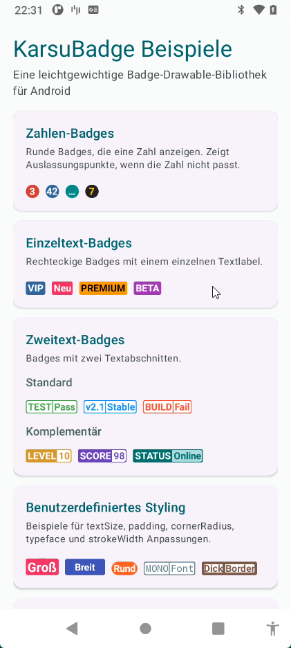
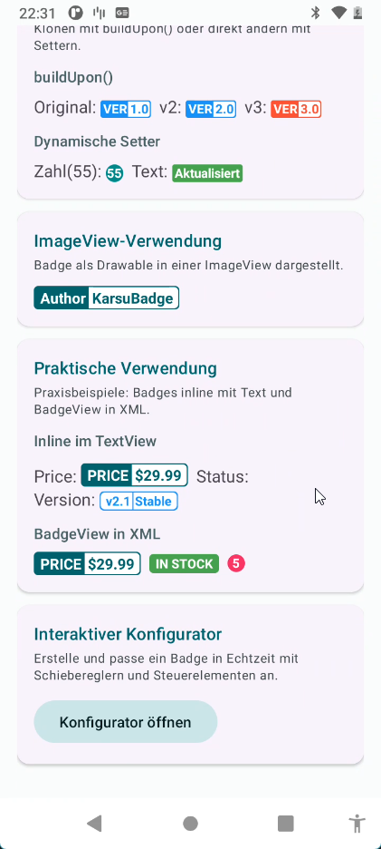
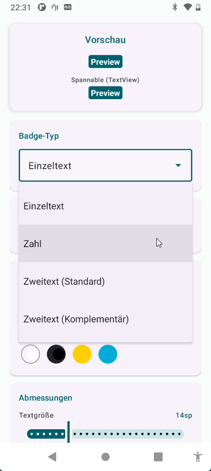
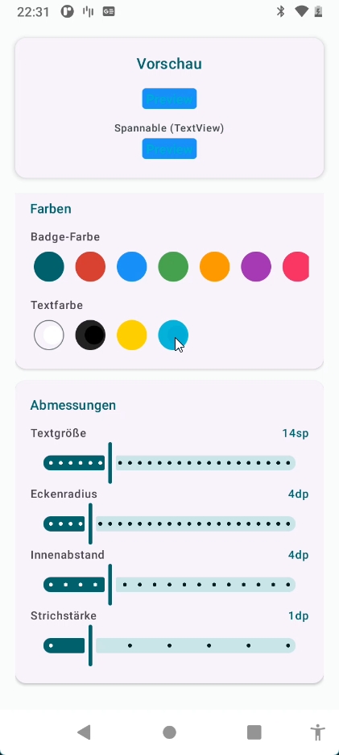

# KarSu-Badge

Lightweight and customizable badge drawable library for Android, written in Kotlin.

Inspired by [nekocode/Badge](https://github.com/nekocode/Badge).

## Screenshots

<p align="center">
  
  
  
  
</p>

## Features

- 4 badge types: number, single text, dual text, complementary dual text
- Use as a `Drawable`, inline `SpannableString`, or XML `BadgeView`
- Full XML attribute support with `BadgeView`
- Builder pattern and Kotlin DSL for programmatic creation
- Customizable: colors, text size, corner radius, padding, stroke width, typeface
- Clone and modify badges with `buildUpon()`
- Dynamic updates via setters (no rebuild needed)
- Interactive configurator in the sample app
- i18n support (English, German, Turkish)

## Setup

### Option 1: JitPack (Remote Dependency)

[](https://jitpack.io/#kaplanerkan/KarSu-Badge)

**settings.gradle.kts**
```kotlin
dependencyResolutionManagement {
    repositories {
        google()
        mavenCentral()
        maven { url = uri("https://jitpack.io") }
    }
}
```

**app/build.gradle.kts**
```kotlin
dependencies {
    implementation("com.github.kaplanerkan:KarSu-Badge:1.0.1")
}
```

### Option 2: Local Module

**settings.gradle.kts**
```kotlin
include(":karsu_badge")
```

**app/build.gradle.kts**
```kotlin
dependencies {
    implementation(project(":karsu_badge"))
}
```

---

## Badge Types

| Type | Constant | Description |
|------|----------|-------------|
| Number | `TYPE_NUMBER` | Circular badge showing a number. Displays ellipsis when the number doesn't fit. |
| Single Text | `TYPE_ONLY_ONE_TEXT` | Rectangular badge with one text label (e.g. "VIP", "NEW", "SALE"). |
| Two Text | `TYPE_WITH_TWO_TEXT` | Two sections with white backgrounds and text in badge color (e.g. "BUILD \| Pass"). |
| Complementary | `TYPE_WITH_TWO_TEXT_COMPLEMENTARY` | Left section with text, right section with colored background (e.g. "PRICE \| $29.99"). |

---

## Usage

There are 3 ways to use KarSu-Badge:

### 1. BadgeView in XML (Recommended)

The easiest way. Place `BadgeView` directly in your layout XML:

```xml
<com.panda.karsu_badge.BadgeView
    android:id="@+id/badgePrice"
    android:layout_width="wrap_content"
    android:layout_height="wrap_content"
    app:badgeType="twoTextComplementary"
    app:badgeText1="PRICE"
    app:badgeText2="$29.99"
    app:badgeColor="#006A6A"
    app:badgeTextSize="14sp"
    app:badgeCornerRadius="4dp"
    app:badgePaddingLeft="6dp"
    app:badgePaddingTop="4dp"
    app:badgePaddingRight="6dp"
    app:badgePaddingBottom="4dp"
    app:badgePaddingCenter="6dp" />
```

Update it from code:

```kotlin
binding.badgePrice.setBadgeText2("$19.99")
binding.badgePrice.setBadgeColor(0xffE91E63.toInt())
```

Swap the entire badge:

```kotlin
val newBadge = badgeDrawable {
    type(BadgeDrawable.TYPE_ONLY_ONE_TEXT)
    text1("SOLD OUT")
    badgeColor(0xffF44336.toInt())
}
binding.badgePrice.setBadgeDrawable(newBadge)
```

#### All XML Attributes

| Attribute | Format | Description |
|-----------|--------|-------------|
| `app:badgeType` | `number` \| `oneText` \| `twoText` \| `twoTextComplementary` | Badge type |
| `app:badgeNumber` | integer | Number to display (`number` type) |
| `app:badgeText1` | string | Primary text |
| `app:badgeText2` | string | Secondary text (dual-text types) |
| `app:badgeTextSize` | dimension | Text size (e.g. `12sp`) |
| `app:badgeColor` | color | Badge background color |
| `app:badgeTextColor` | color | Text color |
| `app:badgeText2Color` | color | Text2 section color (complementary type) |
| `app:badgeCornerRadius` | dimension | Corner radius (e.g. `4dp`) |
| `app:badgePaddingLeft` | dimension | Left padding |
| `app:badgePaddingTop` | dimension | Top padding |
| `app:badgePaddingRight` | dimension | Right padding |
| `app:badgePaddingBottom` | dimension | Bottom padding |
| `app:badgePaddingCenter` | dimension | Center gap between dual-text sections |
| `app:badgeStrokeWidth` | dimension | Border/stroke width |

### 2. Programmatic Creation (Kotlin DSL)

```kotlin
import com.panda.karsu_badge.BadgeDrawable
import com.panda.karsu_badge.badgeDrawable

val badge = badgeDrawable {
    type(BadgeDrawable.TYPE_ONLY_ONE_TEXT)
    text1("NEW")
    badgeColor(0xffE91E63.toInt())
    textColor(0xffFFFFFF.toInt())
    textSize(spToPx(14f))
    cornerRadius(dpToPx(4f))
    padding(
        left = dpToPx(6f),
        top = dpToPx(4f),
        right = dpToPx(6f),
        bottom = dpToPx(4f)
    )
}
```

### 3. Builder Pattern

```kotlin
val badge = BadgeDrawable.Builder()
    .type(BadgeDrawable.TYPE_WITH_TWO_TEXT_COMPLEMENTARY)
    .text1("SCORE")
    .text2("98")
    .badgeColor(0xff673AB7.toInt())
    .textColor(0xffFFFFFF.toInt())
    .textSize(spToPx(12f))
    .cornerRadius(dpToPx(4f))
    .padding(dpToPx(6f), dpToPx(3f), dpToPx(6f), dpToPx(3f), dpToPx(4f))
    .strokeWidth(dpToPx(1f).toInt())
    .build()
```

---

## Displaying Badges

### Inline in a TextView

Use `toSpannable()` to embed badges inside text:

```kotlin
val priceBadge = badgeDrawable {
    type(BadgeDrawable.TYPE_WITH_TWO_TEXT_COMPLEMENTARY)
    text1("PRICE"); text2("$29.99")
    badgeColor(0xff006A6A.toInt())
}

val statusBadge = badgeDrawable {
    type(BadgeDrawable.TYPE_ONLY_ONE_TEXT)
    text1("Online")
    badgeColor(0xff4CAF50.toInt())
}

textView.text = SpannableString(
    TextUtils.concat(
        "Price: ", priceBadge.toSpannable(),
        "  Status: ", statusBadge.toSpannable()
    )
)
```

### In an ImageView

```kotlin
imageView.setImageDrawable(badge)
```

### Multiple Badges in a TextView

```kotlin
fun TextView.showBadges(vararg badges: BadgeDrawable) {
    val parts = mutableListOf<CharSequence>()
    badges.forEachIndexed { i, badge ->
        if (i > 0) parts.add("  ")
        parts.add(badge.toSpannable())
    }
    text = SpannableString(TextUtils.concat(*parts.toTypedArray()))
}

// Usage
textView.showBadges(badge1, badge2, badge3)
```

---

## Modifying Badges

### Clone with buildUpon()

Create a modified copy without affecting the original:

```kotlin
val original = badgeDrawable {
    type(BadgeDrawable.TYPE_WITH_TWO_TEXT_COMPLEMENTARY)
    text1("VER"); text2("1.0")
    badgeColor(0xff2196F3.toInt())
}

val v2 = original.buildUpon().text2("2.0").build()
val v3 = original.buildUpon().text2("3.0").badgeColor(0xffF44336.toInt()).build()
```

### Dynamic Setters (In-place Mutation)

Modify an existing badge directly. The badge redraws automatically:

```kotlin
val badge = BadgeDrawable.Builder()
    .type(BadgeDrawable.TYPE_NUMBER)
    .number(1)
    .badgeColor(0xffCC3333.toInt())
    .build()

// Update values later
badge.setNumber(55)
badge.setBadgeColor(0xff009688.toInt())
badge.setTextColor(0xffFFD700.toInt())
badge.setText1("Updated")
badge.setTextSize(spToPx(16f))
badge.setCornerRadius(dpToPx(8f))
badge.setStrokeWidth(dpToPx(2f).toInt())
badge.setTypeface(Typeface.MONOSPACE)
badge.setText2Color(0xffB2DFDB.toInt())
```

---

## Complete Examples

### Notification Count Badge

```kotlin
badgeDrawable {
    type(BadgeDrawable.TYPE_NUMBER)
    number(42)
    badgeColor(0xffCC3333.toInt())
}
```

### Status Label

```kotlin
badgeDrawable {
    type(BadgeDrawable.TYPE_ONLY_ONE_TEXT)
    text1("PREMIUM")
    badgeColor(0xffFF9800.toInt())
    textColor(0xff000000.toInt())
}
```

### Build Status Badge

```kotlin
badgeDrawable {
    type(BadgeDrawable.TYPE_WITH_TWO_TEXT)
    text1("BUILD")
    text2("Pass")
    badgeColor(0xff4CAF50.toInt())
}
```

### Level / Score Badge

```kotlin
badgeDrawable {
    type(BadgeDrawable.TYPE_WITH_TWO_TEXT_COMPLEMENTARY)
    text1("LEVEL")
    text2("10")
    badgeColor(0xffCC9933.toInt())
    text2Color(0xffFFFFFF.toInt())
}
```

### Fully Custom Badge

```kotlin
badgeDrawable {
    type(BadgeDrawable.TYPE_ONLY_ONE_TEXT)
    text1("Custom")
    badgeColor(0xffE91E63.toInt())
    textSize(spToPx(16f))
    cornerRadius(dpToPx(20f))
    typeface(Typeface.MONOSPACE)
    padding(
        left = dpToPx(12f),
        top = dpToPx(4f),
        right = dpToPx(12f),
        bottom = dpToPx(4f)
    )
    strokeWidth(dpToPx(2f).toInt())
}
```

### Price Tag in XML

```xml
<LinearLayout
    android:layout_width="wrap_content"
    android:layout_height="wrap_content"
    android:orientation="horizontal"
    android:gravity="center_vertical">

    <com.panda.karsu_badge.BadgeView
        android:layout_width="wrap_content"
        android:layout_height="wrap_content"
        app:badgeType="twoTextComplementary"
        app:badgeText1="PRICE"
        app:badgeText2="$29.99"
        app:badgeColor="#006A6A"
        app:badgeTextSize="14sp"
        app:badgeCornerRadius="4dp"
        app:badgePaddingLeft="6dp"
        app:badgePaddingTop="4dp"
        app:badgePaddingRight="6dp"
        app:badgePaddingBottom="4dp"
        app:badgePaddingCenter="6dp" />

    <com.panda.karsu_badge.BadgeView
        android:layout_width="wrap_content"
        android:layout_height="wrap_content"
        android:layout_marginStart="8dp"
        app:badgeType="oneText"
        app:badgeText1="IN STOCK"
        app:badgeColor="#4CAF50"
        app:badgeTextSize="12sp"
        app:badgeCornerRadius="4dp" />

</LinearLayout>
```

---

## Configuration Reference

| Method (Builder/DSL) | Setter | Getter | Default |
|----------------------|--------|--------|---------|
| `type()` | `setBadgeType()` | `getBadgeType()` | `TYPE_NUMBER` |
| `number()` | `setNumber()` | `getNumber()` | `0` |
| `text1()` | `setText1()` | `getText1()` | `""` |
| `text2()` | `setText2()` | `getText2()` | `""` |
| `badgeColor()` | `setBadgeColor()` | `getBadgeColor()` | `0xffCC3333` (red) |
| `textColor()` | `setTextColor()` | `getTextColor()` | `0xffFFFFFF` (white) |
| `text2Color()` | `setText2Color()` | `getText2Color()` | `null` (uses textColor) |
| `textSize()` | `setTextSize()` | `getTextSize()` | `12sp` |
| `typeface()` | `setTypeface()` | `getTypeface()` | `Typeface.DEFAULT_BOLD` |
| `cornerRadius()` | `setCornerRadius()` | `getCornerRadius()` | `2dp` |
| `padding()` | `setPaddingValues()` | `getPaddingLeftValue()` etc. | `2dp, 2dp, 2dp, 2dp, 3dp` |
| `strokeWidth()` | `setStrokeWidth()` | `getStrokeWidth()` | `1dp` |

---

## Sample App

The sample app includes:

- All 4 badge type examples
- Custom styling demos (text size, padding, corner radius, typeface, stroke width)
- `buildUpon()` cloning and dynamic setter mutation
- Practical usage: inline badges in TextViews, `BadgeView` in XML layouts
- **Interactive Configurator**: real-time badge builder with type dropdown, color presets, and dimension sliders
- i18n: English, German, Turkish

## License

```
Copyright 2026 KarsuBadge

Licensed under the Apache License, Version 2.0 (the "License");
you may not use this file except in compliance with the License.
You may obtain a copy of the License at

   http://www.apache.org/licenses/LICENSE-2.0

Unless required by applicable law or agreed to in writing, software
distributed under the License is distributed on an "AS IS" BASIS,
WITHOUT WARRANTIES OR CONDITIONS OF ANY KIND, either express or implied.
See the License for the specific language governing permissions and
limitations under the License.
```
